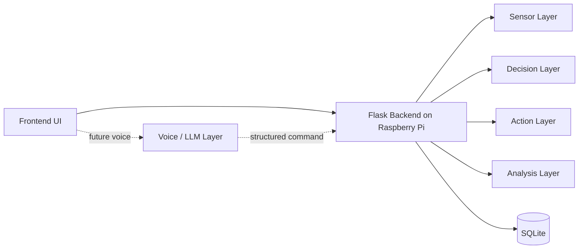

# Problem Analysis And Design

## Problem Analysis

Household energy waste is usually room-local, not house-global. A realistic system needs to know which rooms are occupied, how bright they are, how warm and humid they feel, and whether a room is currently following automation or manual override.

## Single-App Architecture



## Core Layers

### Sensor Layer

- Maintains room-local sensor state
- Tracks temperature, humidity, ambient light, and occupancy count per room
- Supports simulation mode now and hardware-backed input later

### Analysis Layer

- Derives occupancy level from room-local occupancy count
- Computes room power, room session cost, global active power, hourly cost, and daily projection
- Produces structured summaries for recommendations

### Decision Layer

- Evaluates automation room by room
- Respects resolved room mode:
  - `AUTO`
  - `MANUAL`
- Uses local room sensors instead of one global toy state

### Action Layer

- Applies light brightness and fan speed locally per room
- Honors room-level manual protection
- Logs compact decision events

### Voice / LLM Layer

This is a future integration point, not part of the basic control loop.

Planned flow:

1. Voice input
2. Speech-to-text
3. LLM parses utterance into structured JSON
4. Backend validates room/device/action
5. Action Layer executes command
6. Response layer returns a natural confirmation or error explanation

Failure paths to handle:

- Unknown room
- Unsupported device/action
- Ambiguous intent
- Invalid schema

The same layer can also generate natural-language explanations from structured room summaries and trends rather than raw logs.

## Mode Model

### Global Mode

- `AUTO`
- `MANUAL`

### Room Mode

- `FOLLOW_GLOBAL`
- `LOCAL_AUTO`
- `LOCAL_MANUAL`

Resolved room mode determines whether automation or manual sliders control that room.

## State Model

```json
{
  "global_mode": "AUTO",
  "rooms": {
    "bedroom": {
      "mode": "FOLLOW_GLOBAL",
      "resolved_mode": "AUTO",
      "sensors": {
        "temperature": 25,
        "humidity": 54,
        "ambient_light": 40,
        "occupancy_count": 1,
        "occupancy_level": "Low"
      },
      "devices": {
        "light": { "brightness": 70, "state": "ON" },
        "fan": { "speed_percent": 45, "state": "ON" }
      }
    }
  }
}
```
